# Histopathologic-Cancer-Detection

## Project Goal

* Project understanding
* Data understanding
* Data visualization
* Baseline model (Fastai v1)
* Validation and analysis
* Metrics
* Prediction and activation visualizations
* ROC & AUC
* Submit

## Data understanding provided by [Kaggle](https://www.kaggle.com/c/histopathologic-cancer-detection/data)
In this dataset, you are provided with a large number of small pathology images to classify. Files are named with an image id. The `train_labels.csv` file provides the ground truth for the images in the train folder. You are predicting the labels for the images in the test folder. ***A positive label indicates that the center `32x32px` region of a patch contains at least one pixel of tumor tissue.*** Tumor tissue in the outer region of the patch ***does not*** influence the label. This outer region is provided to enable fully-convolutional models that do not use zero-padding, to ensure consistent behavior when applied to a whole-slide image.

<p align="center">
  
</p>

## First Steps for Learning
It is often a good idea to evaluate a simple model's performance over the given dataset to set boundaries.

### CNN Model
Here I created and fit a simple CNN model with only ***8000*** parameters. the model performance was acceptable with an accuracy rate of ***0.8336%*** on train set and ***0.8307%*** on validation set, after 50 epochs.

Model Accuracy            |  Model Loss
:-------------------------:|:-------------------------:
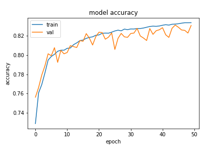  |  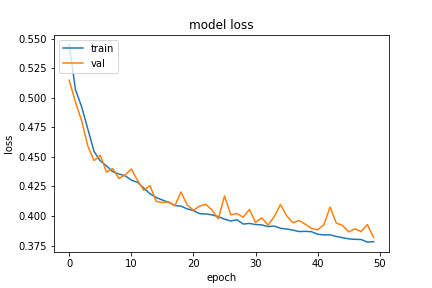

The model doesn't have enough parameters to fit perfectly on the train set, although it is fed with ***200K 16x16*** uncropped images. To enhance the performance, I have increased number of fully connected layers and added `L2` regulation terms to them to prevent the model from overfitting.
By only adding few more layers, the accuracy rate increased to ***0.8754%*** over train set and ***0.8733%*** over test set.

Model Accuracy (Tuned)            |  Model Loss (Tuned)
:-------------------------:|:-------------------------:
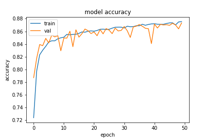  |  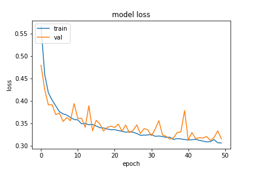


The models performance is good. However, it's not good enough.

## Keras Image Data Generator
To use [Keras's Image Data Generator]("https://keras.io/api/preprocessing/image/"), it is required to split `train` and `validation` directories, as it is shown below:


### Steps
* Separate and move data according to their label
* Split data to `train` and `valid` parts
* Create a CNN model
* Set values to `Data Generator` hyperparameters
* Fit the model

After I took these steps, the out coming result was amazing! The accuracy and loss plots demonstrates the differences.

Model Accuracy (Generator Model) |  Model Loss (Generator Model)
:-------------------------:|:-------------------------:
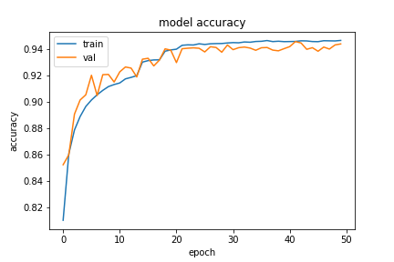  |  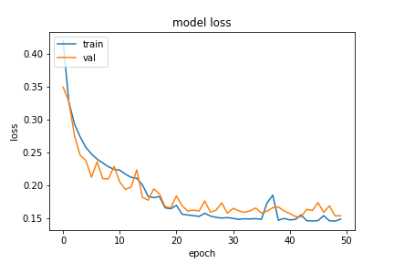

Using KIDG (Keras Image Data Generator), I reached ***0.9467%*** accuracy over train set and ***0.9441%*** over validation set, after ***50*** epochs.

## Crop Images
According to the [Kaggle Competition Page](https://www.kaggle.com/c/histopathologic-cancer-detection/data), ***A positive label indicates that the center `32x32px` region of a patch contains at least one pixel of tumor tissue.*** Tumor tissue in the outer region of the patch ***does not*** influence the label. Thus, data in outer layers of the images are less important and can be ignored.

<p align="center">
  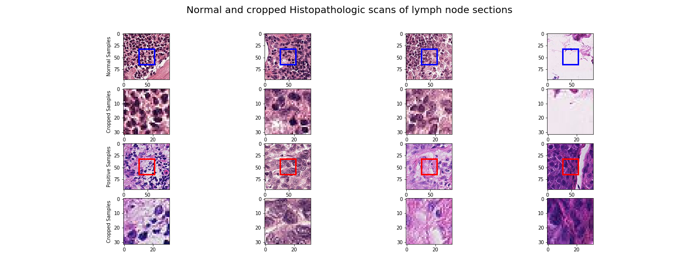
</p>

At the above plot, first row indicates the images of normal tissues without tumor with `blue` patch indicating its central `32x32` pixels, and the second row is the cropped section of the images.
As the same, third includes images with tumors, and the forth row images are cropped sections of them.

To work with `Keras Image Data Generator`, it's necessary to crop and save images to specific directories as shown above. To do so, It can done by using `crop_and_save_images` function witch takes main directory path as input parameter `path`.
After separating images into directories, it's needed to create the convolutional model.

### Phase I
At first try, I used the same model which I used to train over normal non-cropped images with ***1.6 million*** parameters. However, the result was not satisfying.

Model Accuracy (Cropped Images - 20 epochs) |  Model Loss (Cropped images - 20 epochs)
:-------------------------:|:-------------------------:
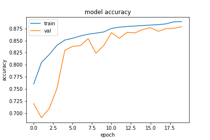  |  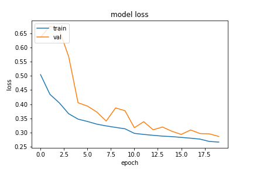


Model Accuracy (Cropped Images - 100 epochs) |  Model Loss (Cropped images - 100 epochs)
:-------------------------:|:-------------------------:
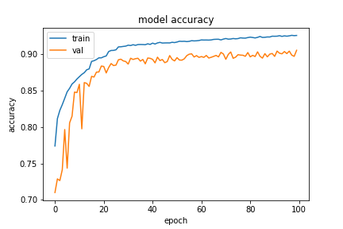  |  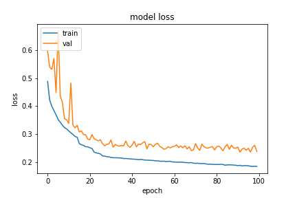

According to the above plots, it's obvious that even after ***100** epochs, the model is unable to get fit over the train and validation set. My first assumption was that there is something wrong with the `learning rate` or `optimizer`, but after several attempts it came out that it's not about the hyperparameters.
After trying `ResNet` models with about ***6 million*** parameters, there was no significant improvement in accuracy rate, and the model was stuck at about ***94%*** accuracy over train set.

### Phase II
I decided to used more complex models with more learnable parameters. After several tries, `Densenet` models were able to fit over the given data. 

Densnet Accuracy (Cropped Images - 100 epochs) |  Densnet Loss (Cropped images - 100 epochs)
:-------------------------:|:-------------------------:
  |  


### Steps
* Crop seperated images
* Feeding data to Image Data Generator

## ToDo List:

- [x] Create README.md file.
- [x] Visualize data
- [x] Data preparation
- [x] Create a bash file for submitting results to Kaggle
- [x] Prepare a initial working model
- [x] Hyperparameter tuning
- [x] Find best Learning rate
- [x] Plotting loss and accuracy plots
- [ ] Finding a suitable model
- [ ] Tensorboard logs


## How to run
Using `submit_csv.sh` file you can submit your `submission.csv` file to kaggle.
*Note:* Please make sure that your `api_key` exists in `~/.kaggle/`. For more information visit [kaggle](https://www.kaggle.com/docs/api).

```bash
chmod +x submit_csv.sh

./submit_csv.sh `comment`
```

## Refrences

