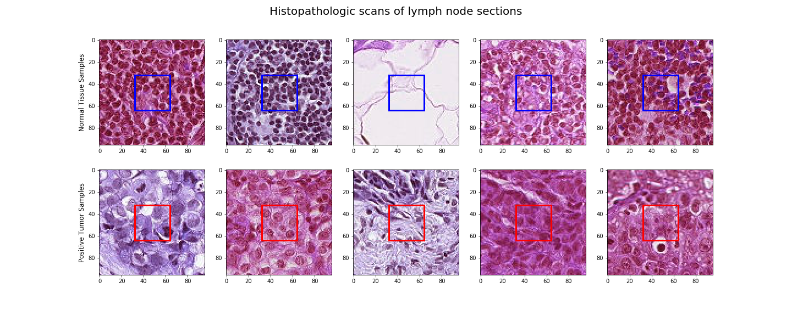

# Histopathologic-Cancer-Detection

## Project Goal

* Project understanding
* Data understanding
* Data visualization
* Baseline model (Fastai v1)
* Validation and analysis
* Metrics
* Prediction and activation visualizations
* ROC & AUC
* Submit

## Data understanding provided by [Kaggle](https://www.kaggle.com/c/histopathologic-cancer-detection/data)
In this dataset, you are provided with a large number of small pathology images to classify. Files are named with an image id. The `train_labels.csv` file provides the ground truth for the images in the train folder. You are predicting the labels for the images in the test folder. ***A positive label indicates that the center `32x32px` region of a patch contains at least one pixel of tumor tissue.*** Tumor tissue in the outer region of the patch ***does not*** influence the label. This outer region is provided to enable fully-convolutional models that do not use zero-padding, to ensure consistent behavior when applied to a whole-slide image.

## ToDo List:

- [x] Create README.md file.
- [x] Visualize data
- [ ] Data preparation

## How to run

## Credits

## Refrences

